# Matheus Simões

Hello! I'm **Matheus Simões**, a 28-year-old **Game and Software Developer** with over **10 years of professional experience** and a degree in **Computer Engineering**. 👨‍💻  
I have national and international experience collaborating with clients such as **Sony Music, Globo, Paramount, Nickelodeon**, and several startups, working as both a **Game Developer** and **Backend Developer**.  
My expertise includes **Unity**, **C#/.NET**, **Unreal Engine**, **Construct 3**, and **Phaser**, as well as **AWS**, **CI/CD with GitHub Actions**, **payment integrations** (Stripe, Apple Pay, Google Pay), and publishing on the **App Store** and **Google Play**.  

---

## 📊 Stats

  

  

  
📊 Detailed metrics

  

    
  

---

## 🛠️ Skills

**Backend and Frontend Development**
- C#, .NET, ASP.NET MVC  
- Python  
- C++  
- HTML, CSS, JavaScript  
- React, Node.js  
- PHP  

**Game and App Development**
- Unity3D (VR, AR, XR, WebGL, Mobile)  
- Unreal Engine  
- Construct 3  
- PixiJS  
- Phaser  
- OpenXR, Oculus ToolKit, MRTK  
- CI/CD Automation with GitHub Actions  
- Payment Integrations (Stripe, Apple Pay, Google Pay)  

**Cloud and Infrastructure**
- AWS (S3, EC2, RDS)  
- Azure  
- Git/GitHub, GitHub Actions  
- MySQL, Oracle, MongoDB  

---

## 💼 Experience (summary)

- **Lumina Lab (2025)** – Backend & Game Dev (VR + AI for architecture, Meta Store, CI/CD)  
- **Sony Music Entertainment (2024–2025)** – Game Dev (corporate multiplayer game, WebGL, AWS, CI/CD)  
- **Real Games Studio (2023 – present)** – Developer & Technical Artist (immersive experiences for Globo, Paramount, Nickelodeon, etc.)  
- **Clickideia (2022–2023)** – Educational Game Developer (Unity, Construct 3, Phaser)  
- **67bits Studio (2022–2023)** – Team Lead (mobile games, Unity, Google Play publishing)  
- **TopMid Studio (2021)** – CEO & Game Dev (Unity/Unreal, VR/AR, XR, Meta Quest)  
- **Black Mamba Games (Portugal, 2021–2022)** – Game Dev (NFT/Web, Unity, Blockchain)  
- **GoFretes (2021)** – Fullstack Dev (ASP.NET MVC, MySQL, Azure)  
- **Perimeter/Marathon (Canada, 2021)** – Software Dev (Unity, WebGL, English-speaking meetings)  

