# Matheus Simões

Sou Matheus Simões (28). Formado em **Engenharia da Computação**, foco em **Backend para games** — sempre aprendendo coisas novas! 👨🏼‍🎓

---

## 📊 Stats

  

<!-- Streak (constância de commits) -->

  

<!-- Metrics (gera github-metrics.svg via workflow) -->

  

---

## 🛠️ Skills

**Desenvolvimento Frontend e Backend**
- C#
- C++
- ASP.NET MVC
- HTML, CSS, JavaScript
- React, Node.js

**Desenvolvimento de apps e games**
- Unity
- Unreal
- Construct 3
- Realidade Virtual (VR)
- Realidade Aumentada (AR)

---

## 💼 Trabalhos

**GoFretes —** Full-stack Developer

**Internacional | AppMasters —** Marathon App  
- Drawer builder para profissionais

---

## 📌 Destaques

  
  

> Dica: troque `SEU_REPO_1` e `SEU_REPO_2` pelos repositórios que você quer destacar (os que têm README bonito, prints/gifs, etc).
